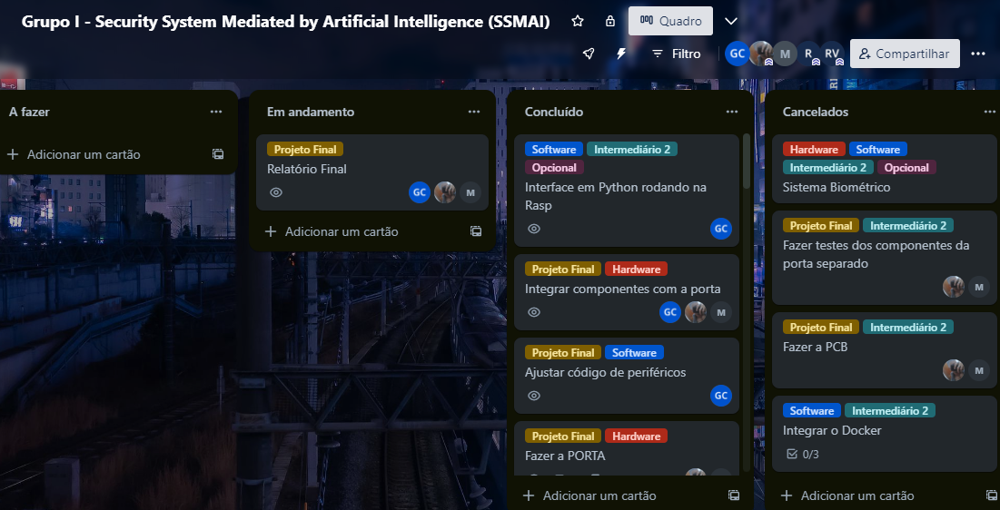
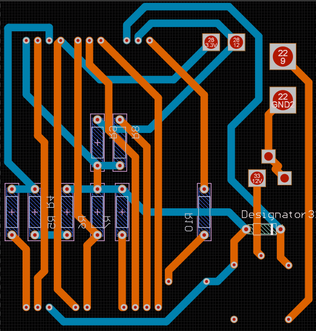
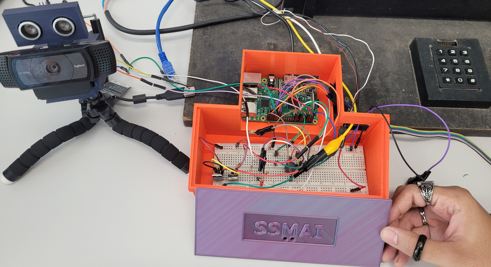
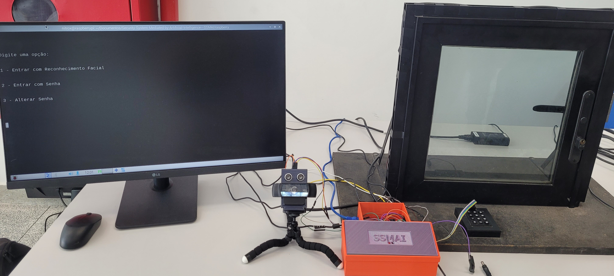

# Security System Mediated by Artificial Intelligence - SSMAI

> Sistema de segurança domiciliar utilizando inteligência artificial no reconhecimento facial para abrir portas.

## Conteúdo
- [Introdução](#introdução)
- [Software](#software)
	- [telegram_bot](#telegram_bot)
	- [site](#site)
	- [raspberry](#raspberry)
- [Hardware](#hardware)
	- [Componentes](#componentes)
    - [Circuito](#circuito)
- [Funcionamento](#funcionamento)
- [Demonstração](#demonstração)
- [Agradecimentos](#agradecimentos)
- [Autores](#autores)

## Introdução
Com o objetivo de produzir um trabalho que integra software e hardware para a matéria de Projeto Integrado de Computação II (PIC II), os alunos da graduação do curso de Engenharia de Computação da Universidade Federal do Espírito Santo, Gabrielly Cariman e Mayke Wallace, desenvolveram um projeto voltado para a área de segurança.

A ideia era construir um sistema domiciliar baseado em reconhecimento facial utilizando inteligência artificial, e, devido a isso, o grupo foi nomeado como **_Security System Mediated by Artificial Intelligence - SSMAI_**.

O trabalho foi dividido em tarefas (tasks), que tinham uma label em comum, sendo de hardware ou de software, que foram divididas pela equipe. O desenvolvimento do projeto foi organizado utilizando o Kanban do Trello, resultando em um quadro que pode ser visualizado na figura abaixo.

## Software

Este repositório documenta o projeto e o software desenvolvido. O código foi escrito em Python e pode ser encontrado em três pastas principais, cada pasta contém a explicação de como instalar e rodar os programas:

### telegram_bot
Nesta pasta, encontra-se o código responsável por executar um bot do Telegram para cadastro de proprietários do nosso produto. O bot foi desenvolvido usando a biblioteca *python-telegram-bot*, que permite a interação com a plataforma do Telegram. Ele registra o email do proprietário e salva o Chat ID do Telegram para futuras comunicações. O código é executado na  VM (Máquina Virtual) fornecida pela UFES (Universidade Federal do Espírito Santo).

### site
O site é executado na mesma VM do bot do Telegram e foi desenvolvido usando o framework Django, framework web de código aberto, escrito em Python. O projeto Django, chamado "django_ssmai", contém a aplicação "ssmai". O banco de dados utilizado é o SQLite.

No site, a equipe realiza o cadastro inicial das pessoas que adquiriram o produto, como mostrado no GIF abaixo:

Cadastro Inicial

Posteriormente, as pessoas cadastradas acessam o site e se registram no bot do Telegram, conforme demonstrado no GIF abaixo:

Registro no Bot

Após adquirir o produto, uma Raspberry Pi é instalada na casa do proprietário e recebe as configurações necessárias. O sistema permite o cadastro de hóspedes, incluindo suas informações e fotos:

Cadastro de Hóspedes

O primeiro hóspede a ser cadastrado é o próprio proprietário, caso ele deseje usar o reconhecimento facial.

As fotos dos hóspedes são armazenadas localmente e o banco de dados SQLite contém apenas o caminho para a foto. Além disso, é gerado um encoding usando a biblioteca *face_recognition*, e esse encoding é salvo localmente no formato pickle. Quando uma nova foto é adicionada, um tópico MQTT informa a Raspberry Pi, que solicita o arquivo pickle correspondente através de uma requisição ao site.

### raspberry
Nesta pasta, estão todos os códigos necessários para o funcionamento da Raspberry Pi. Alguns dos arquivos incluídos são:

- **config.py**: Define todos os GPIOS da Raspberry Pi e requer que o email do proprietário seja alterado para fins de configuração.
- **mqtt.py**: Estabelece a conexão com o MQTT para requisição ou exclusão de encodings de pessoas cadastradas no site.
- **main.py**: Responsável por fazer a interface com a pessoa que deseja entrar na casa e determinar se o acesso será concedido por reconhecimento facial ou senha.
- **gate.py**: Controla a abertura da porta quando uma pessoa é autorizada a entrar.
- **keyboard.py**: Realiza a interação com o teclado para capturar as teclas pressionadas.
- **photo_capture.py**: Responsável por tirar fotos das pessoas e mostrar a imagem capturada.
- **recognizer.py**: Gera o encoding da imagem da pessoa e compara com os encodings armazenados na Raspberry Pi, que foram requisitados do site. Além disso, interage com o bot do Telegram definido no arquivo telegram_bot.py, enviando a foto da pessoa que deseja entrar e perguntando se o proprietário deseja permitir o acesso.
- **reed.py**: Responsável por obter leituras do sensor magnético reed.

Essa é uma visão geral do projeto, descrevendo suas principais funcionalidades e estrutura, tanto no site como na Raspberry Pi.

## Hardware

### Componentes
- 01 Piezo Buzzer
- 01 LED vermelho
- 01 LED verde
- Resistores
    - 2x 330 Ω
    - 4x 1k Ω
    - 1x 10k Ω
- 01 Raspberry Pi 3 B+ (Raspberry OS 64-bit)
- 01 TIP42C
- 01 TIP31C
- Jumpers
- 01 Reed Switch
- 01 Ímã
- 01 Maquete de porta eletrônica
- 01 Câmera
- 01 Ultrassom
- 01 Monitor
- 01 Protoboard

### Circuito

Em uma primeira etapa, foi desenvolvida uma placa de circuito impresso com a finalidade de conter todos os componentes soldados à placa e suas respectivas conexões, conforme pode ser observado na imagem abaixo.

Entretanto, após realizar todas as conexões e procedimentos de soldagem, o primeiro teste utilizando essa placa desenvolvida resultou em falha.

Diante disso, a protoboard foi utilizada para realizar todas as ligações de forma mais flexível. Assim, foi possível obter o circuito desejado e funcional, que agora pode ser visualizado na imagem abaixo.

Os pinos GPIOs da Raspberry são uma interface física entre a Raspberry Pi e o mundo exterior. No nível mais simples, é possível pensar neles como interruptores que podem ser ligar ou desligar (entrada) ou que a Raspberry pode ligar ou desligar (saída).

Os pinos GPIO permitem que a Raspberry Pi controle e monitore o mundo exterior ao ser conectado a circuitos eletrônicos. 

A identificação de para que cada pino da Raspberry é usado pode ser vista abaixo.

**Pinos**
- 3V3: Qualquer coisa conectada a esses pinos sempre receberá 3,3V de energia
- 5V: 	Qualquer coisa conectada a esses pinos sempre receberá 5V de energia
- GND: "Zero" volts, terra, usado como a referência para o circuito
- GPIO N: Esses pinos são para uso geral e podem ser configurados como pinos de entrada ou saída

**Conexões dos LEDs**

As conexões dos LEDs foram feitas de forma parecida com a da imagem abaixo. Porém, foram usados resistores de 330 Ω o LED verde foi conectado ao GPIO 22 e o LED vermelho realmente foi conectado no GPIO 17.

**Conexão do Buzzer**

As conexões do Buzzer foi feita de forma parecida com a da imagem abaixo. Porém, o Buzzer foi conectado ao GPIO 21.

**Conexão do Sensor de Distância Ultrassônico**

As conexões do Sensor de Distância Ultrassônico foi feita de forma parecida com a da imagem abaixo. Porém, foram usados resistores de 330 Ω  e 1k Ω para o divisor de tensão e o ECHO do Sensor de Distância Ultrassônico foi conectado ao GPIO 27 e o TRIG realmente foi conectado ao GPIO 4.

As conexões dos outros componentes seguiram de forma semelhante. Conectando resistores, transistores, alimentação e GND de forma necessária para que o circuito funcione corretamente.

 
## Funcionamento
O sistema é bem simples. O sensor Reed Switch monitora se a porta está fechada ou aberta. Caso a porta esteja aberta, as opções de entrar com o reconhecimento facial ou com a sequência de dígitos ficam bloqueadas até a porta voltar ao estado de fechada, pois não faria sentido tentar abrir uma porta que já está aberta. Com a porta fechada, existem duas formas de poder abri-la, como mencionado anteriormente: 1 - reconhecimento facial ou 2 - sequência de senha.

Por padrão, as senhas são de 4 dígitos e são "1234". Entretanto, existe uma terceira opção para trocar essa senha, nesse caso, o sistema irá pedir para entrar com uma senha de 8 dígitos para poder trocar a senha de 4 dígitos, "12345678".

Em caso de erro na digitação da senha correta, o sistema notificará que a senha colocada está errada, o LED vermelho piscará 3 vezes e um buzzer emitirá um som de apito por 1 segundo.

A opção de abrir a porta por reconhecimento facial é uma segunda alternativa. Ao ser selecionada, o sistema fica monitorando a distância que um rosto de uma pessoa está em relação à câmera. Ao chegar a menos de 40 cm da câmera e após 3 segundos, a câmera tirará uma foto da pessoa presente. Após a confirmação, o sistema fará o match do rosto da pessoa com os rostos presentes no banco de dados do site. Ao obter um resultado, uma mensagem será enviada para o Telegram cadastrado. Pelo Telegram, o dono do produto receberá a foto de quem está querendo abrir a porta e poderá selecionar duas opções: abrir a porta ou mantê-la fechada.

## Demonstração 
> Clique na imagem abaixo, para ver um vídeo da explicação do produto final.

## Agradecimentos
Gostaríamos de fazer menção à Equipe de Robótica da UFES (ERUS) e ao Software Defined Networks Research Group (NERDS) por nos emprestar várias ferramentas, componentes para o desenvolvimento do trabalho e espaço físico. Agradecemos também aos professores [Ricardo](https://scholar.google.com.br/citations?hl=pt-BR&user=ZrIpfkUAAAAJ) e [Rodolfo](https://scholar.google.com.br/citations?hl=pt-BR&user=CvA1RJsAAAAJ), responsáveis pelo PIC II 2023, por esclarecerem muitas de nossas dúvidas e nos encaminharem para as pessoas certas. Um agradecimento especial ao Fernando, atual membro da ERUS, por disponibilizar tempo para imprimir nossos modelos 3D.

Agradecemos a todos que contribuíram para este projeto!

|  |  |  |
|:-----------------------:|:-----------------------:|:-----------------------:|
|[Site](https://erus.ufes.br)|[Site](http://nerds.ufes.br) | [Instagram](https://instagram.com/print3r_decor?igshid=ZDc4ODBmNjlmNQ==)|

## Autores

- Gabrielly Cariman 
 | Estudante de Engenharia de Computação com interesse em Visão Computacional.
|[Linkedin](https://www.linkedin.com/in/gabrielly-barcelos-cariman)|

- Mayke Wallace 
 | Estudante de Engenharia de Computação com interesse em Sistemas Embarcados.
|[Linkedin](https://www.linkedin.com/in/mayke-wallace-silva-alves)|